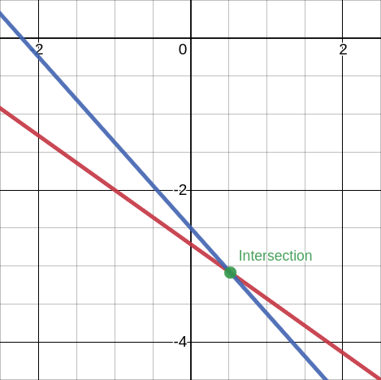
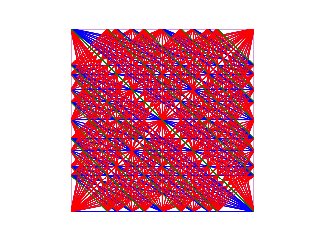
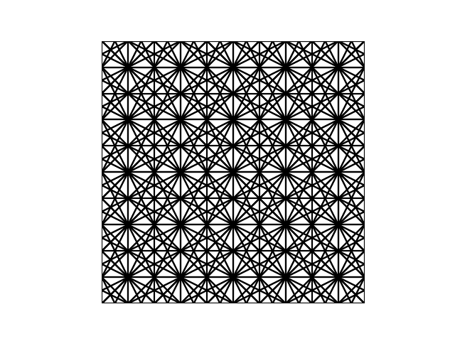

# Topics

## {.observation}
1. Geometric Approach - Idea
2. Finite Precision / Finite Resolution Geometry
	1. Ersatz Line Geometry
3. Interval Geometry
4. Topological Approaches
	1. Snap Rounding
5. Rounded Geometry

-----------------------------------------------------------------------------------

# 1. Geometric Approach - Idea

## {.definition}
-  Geometric = Numeric + Combinatorial
	-  Combinatorial $\equiv$ discrete, topological relations among geometric objects [@SharmaYap]

##
> -  modify existing geometry to accomplish **robustness** (not exactness) [@MehlhornYap]
	-  "ersatz geometry" in fixed precision substitutes original geometry (mostly euclidean / *"POEG"*)
	-  ensure / preserve geometric and topological properties in algorithms [@SharmaYap]
		-  $\rightarrow$ e.g. planar input for voronoi diagram has planar output

-----------------------------------------------------------------------------------

# 2. Finite Precision / Finite Resolution Geometry
-  Usually, geometric objects are representated with continuous parameters

> -  Get **robustness** through transforming geometric objects from continuous to **discrete space**
-  An example for transformation is the Integer Grid (see chapter 4 \& 5)
-  Replace existing geometry with different ersatz geometries

# 2. Line Geometry {.sub}
> -  Line(a, b, c): $$l: ax + by + c = 0$$
-  Intersection(l, l'): $$\left[\begin{matrix}
						a & b\\
						a' & b'
						\end{matrix}\right] \left(\begin{matrix}
											x\\
											y
											\end{matrix}\right) = -\left(\begin{matrix}c\\c'\end{matrix}\right)$$
						$$\Rightarrow \left(\begin{matrix}x\\y\end{matrix}\right) = \frac{1}{\Delta}\left[\begin{matrix}-b' & b\\ a' & -a\end{matrix}\right] \left(\begin{matrix}c\\c'\end{matrix}\right)$$ mit $\Delta = ab' - a'b$ (determinant)

# 2. Line Geometry {.sub}
-  OnLine(p, l): $$ax_p + by_p + c = 0$$

## {.fragment}
![Boolean Operation in Modeling Systems [@MehlhornYap]](img/PolygonBoolean.png)

# 2. Line Geometry {.sub}
-  OnLine(p, l): $$ax_p + by_p + c = 0$$

## Geometric Primitives {.note}
- Operations, predicates and constructors are partial functions

> - These functions can return **True**, **False** and an undefined value ($\boldsymbol{\uparrow}$)
- Undefined Value ($\uparrow$) will be returned for $l=l'$ or $l\parallel l'$ or an undefined input

# 2. Line Geometry Example {.sub .columns}
## {.left}
-  Line(5, 7, 19) $$l: 5x + 7y + 19 = 0$$
-  Line(-9, -8, -20) $$l': -9x -8y -20 = 0$$

## {.right}

## {.bottom .fragment}
- Intersection(l, l'): $$\left(\begin{matrix}x\\y\end{matrix}\right) = \frac{1}{23}\left[\begin{matrix}8 & 7\\ -9 & -5\end{matrix}\right] \left(\begin{matrix}19\\-20\end{matrix}\right) = \left(\begin{matrix}\frac{12}{23}\\-\frac{71}{23}\end{matrix}\right) \approx \left(\begin{matrix}0.52173913043\\3.08695652174\end{matrix}\right)$$

# 2. Line Geometry Example {.sub}
## {.definition .fragment}
- OnLine( Intersect(l, l'), l) should always be **True**

## {.fragment}
- $p_1 = \left(\begin{matrix}\frac{12}{23}\\-\frac{71}{23}\end{matrix}\right)$
- OnLine($p_1$, l): $$5*\frac{12}{23} + 7*-\frac{71}{23} + 19 = 0$$

## {.fragment .alert}
- $p_2$ = $\left(\begin{matrix}0.52173913043\\-3.08695652174\end{matrix}\right)$
- OnLine($p_1$, l): $$5*0.52173913043 + 7*-3.08695652174 + 19 = -3*10^{-11} = 0$$

# 2. Ersatz Line Geometry {.sub .columns}
## {.left}
![[@MehlhornYap]](img/FinitePrecisionLine.png)

## {.right}
> -  Interval Geometry (A)
-  Topological Approach (b)
-  Rounded (Parameter) Geometry
-  Discretized Geometry (*not discussed*)

# 2. Ersatz Line Geometry {.sub .columns}
## {.left}
![[@MehlhornYap]](img/FinitePrecisionLine.png)

## {.note .right}
-  chosen ersatz geometry depends on application needs
	-  which properties have to be preserved

# 2. Ersatz Line Geometry {.sub .columns}
## {.left}
![[@MehlhornYap]](img/FinitePrecisionLine.png)

## {.note .right}
-  One ersatz geometry or its application may have similar properties or steps of another ersatz geometry.

# 2. Ersatz Line Geometry {.sub .columns}
## {.left}
![[@MehlhornYap]](img/FinitePrecisionLine.png)

## {.note .right}
-  Every ersatz geometry will be presented in 2D but can also applied (with modifications to the corresponding algorithms) in 3D.

-----------------------------------------------------------------------------------

# 3. Interval Geometry {.columns}
## {.left}
![[@MehlhornYap]](img/FinitePrecisionLineA.png)

## Abstract {.right}
-  Interval Geometry / Fat Geometry / Epsilon Geometry
-  geometry eqiuvalent of interval arithmetic
-  focus on (approximate) predicate evaluation

# 3. Interval Geometry {.sub .columns}
## {.left}
![[@MehlhornYap]](img/FatPointFatLine.png)

## {.right}
-  zone around object with all points in $\epsilon$ distance to the object
	-  point $\rightarrow$ disk, line $\rightarrow$ strip
-  Point(x,y) on Line(a,b,c)? $\rightarrow$ $|ax + by + c| < \epsilon?$
	-  different possible interpretations

# 3. Interval Geometry {.sub .columns}
## {.left}
![[@MehlhornYap]](img/FatPointFatLine.png)

## Note {.right .note}
- Every object has its own $\epsilon$. In papers the $\epsilon$ are chosen so that $|ax + by + c| < \epsilon$ will not compare to $2\epsilon$ but only $\epsilon$ instead.

# 3. Interval Geometry {.sub .columns}
## {.left}
![[@MehlhornYap]](img/FatIntersectingLines.png)

## {.right}
![[@MehlhornYap]](img/E-Butterfly.png) 

# 3. Interval Geometry {.sub}
## Reminder {.example}
-  Line(a, b, c) $:= ax + by + c = 0$ $\rightarrow$ OnLine( Intersect(l, l'), l) may fail
	-  small computational error can become catastrophic
-  Application in e.g. computational metrology $\rightarrow$ mechanical design and manufacture $\rightarrow \epsilon$ can be used as a tolerance parameter 

# 3. Interval Geometry (General) {.sub .columns}
## {.left}
-  "zones with nonconstant descriptive complexity"
	-  fat object not limited to disks, stripes, ...

## {.right}
![[@MehlhornYap]](img/FatPolygonLine.png)

# 3. Interval Geometry (Segal and Sequin) {.sub}
-  *Fat* geometry as *"toleranced objects"*. Decision if two *fat* objects intersect each other. E.g. is point in range of *fat* object. [@segal1985consistent]
	-  $\epsilon$ describes the maximum allowed distance from the observed object.
	-  So that $|ax +by + c|$ determines the distance of any object to the observed object, the paramaters *a, b, c* and therefore the line itself has to be normalized

## Normalization {.fragment}
- Divide every parameter by $\sqrt{a² + b²}$.
- Line is normalized if $a² + b² = 1$.

# 3. Interval Geometry (Segal and Sequin) {.sub}
## Example
- Line(5, 7, 19) $5x + 7y + 19 = 0$
	- $5² + 7² \neq 1 \rightarrow$ **Normalize**
	- $\rightarrow \sqrt{5²+7²} = \sqrt{74}$ 
- $p = \left(\begin{matrix}0.52173913043\\-3.08695652174\end{matrix}\right)$
- d(l, p) = $3.487*10^{-12} \rightarrow \epsilon = 3.487*10^{-11}$

# 3. Interval Geometry (Segal and Sequin) {.sub}
- Points mistakenly interpreted as *on* the line are *false-positives*.
- Next to $\epsilon$-tweaking another aspect of avoiding false-positives is the **Minimum Feature Size / Separation**

## Minimum Feature Size / Separation {.fragment}
- Points which are too close to the tolerance zone but should not be considered to be "on" the line have to be separated.

## {.fragment}
- A **Minimum Feature Separation** is defined by a **Minimum Feature Size** $\mu$. If regions of size $\mu$ only consist of one point, there is a **Minimum Feature Separation**.

## {.fragment}
- Without a **Minimum Feature Separation**, it is possible that points enter the tolerance zone after e.g. coordinate transformations.
	- The **Minimum Feature Size** can / should be calculated from the coordinate transformation (for more see [@segal1985consistent])

# 3. Minimum Feature Size / Separation (Segal and Sequin) {.sub}
- Merging or pushing points apart that are too close to each other can repair the properties of a **Minimum Feature Separation**. This is conversion is called **Consolidation**

> - Crossing edges get separated in two lines by the intersection point.
- Merge line and point by splitting the line and connect the new line segments to the point (similar to chapter 4)
- Points and Lines are *marked* if they are closer than $(\sqrt{2}+1)\mu$ to another feature.
- Features get separated or merged by an iterative algorithm. Separation or merging may introduce additional separation disturbance. 

# 3. Minimum Feature Size / Separation (Segal and Sequin) {.sub}
![A and B too close together [@milenkovic1988verifiable]](img/Milenkovic1.png)

# 3. Minimum Feature Size / Separation (Segal and Sequin) {.sub}
![Round-Off Error swaps order of A and B [@milenkovic1988verifiable]](img/MilenkovicDoughnut.png)

# 3. Minimum Feature Size / Separation (Segal and Sequin) {.sub}
![A and B pushed apart [@milenkovic1988verifiable]](img/MilenkovicApart.png)

# 3. Minimum Feature Size / Separation (Segal and Sequin) {.sub}
![A and B merged [@milenkovic1988verifiable]](img/MilenkovicMerged.png)

# 3. Minimum Feature Size / Separation (Segal and Sequin) {.sub}
## {.note}
- Some geometric properties will be preserved, while others will be destroyed.

> - Here, LineSegments no longer are collinear ...
- ... but planarity is preserverd.

# 3. Interval Geometry (Guibas, Salesin, Stolfi) {.sub}
-  No Normalization. No Minimum Feature Separation. $\rightarrow$ Focus on points.

> - Assumption that points only known in their $\epsilon$-area. $\rightarrow$ predicates can return **"DON'T KNOW"** value.
-  **DON'T KNOW** value might be the most found value what also can lead to problems.
-  Closest geometric equivalent to *Interval Arithmetic*.
-  Definition of several *new* $\epsilon$-predicates.

# 3. Epsilon Predicates {.sub}
- New predicates which use $\epsilon$ to improve their robustness. [@salesin1989epsilon]

## {.fragment .definition}
-  Those $\epsilon$-predicates return an interval: $\epsilon$-P(X) $\rightarrow$ *"how far is X from satisfying P"*

> -  $\epsilon$-P(X) = $(e_{low}, e_{high})$, also called $\epsilon$-box:
-  $\epsilon < e_{low} \rightarrow$ **FALSE**
-  $e_{low} \leq \epsilon < e_{high} \rightarrow$ **UNKNOWN** $\uparrow$
-  $\epsilon \geq e_{high} \rightarrow$ **TRUE**

# 3. Epsilon Predicates {.sub}
## {.left}
- Intersection: $|ax + by + c| < \epsilon$

> - Comparison: $x < y \rightarrow$ *x* and *y* can be modified by $\epsilon$
- Collinearity of three points

## {.right .fragment}
![$\epsilon$-butterfly [@MehlhornYap]](img/E-Butterfly.png)

# 3. Epsilon Predicates {.sub .columns}
## {.left}
- Orientation of three points

> -  Sign of determinant of\
	$D(p, q, r) = \left(\begin{matrix}1&p.x&p.y\\1&q.x&q.y\\1&r.x&r.y\end{matrix}\right)$
-  $Pos(p, q, r): D(p, q, r) \geq 0$

## {.right}
![[@salesin1989epsilon]](img/EpsilonOrientation.png)

## {.bottom .fragment .alert}
-  $Pos(p, q, r) \neq \neg Neg(p, q, r)$ but $Pos(p, q, r) \wedge Neg(p, q, r) \equiv Collinear(p, q, r)$

# 3. Epsilon Predicates {.sub}
-  The last *"primitive"* $\epsilon$-predicate is $Between(r, pq)$

> - On the basis of these *"primitive"* predicates more complex predicates and therefore complex approximateive algrotihms can be build.
-  Examples are: $Inside(z, T)$, $Boundary(z, T)$, ... (for more see @salesin1989epsilon)

# 3. Epsilon Tweaking {.sub}
-  avoidance of false negatives and false positives

## {.fragment}
> $\epsilon$ depends on two factors:
> the maximum roundoff error per arithmetic operation and the number of arithmetic operations per expression [@milenkovic1988verifiable]

-----------------------------------------------------------------------------------

# 4. Topological Approaches {.columns}
## {.left}
![[@MehlhornYap]](img/FinitePrecisionLineB.png)

## Abstract {.right}
-  find ersatz geometry which is topologically consistent
	-  "topological consistency as a fundamental principle for achieving robustness" ([@MehlhornYap] referring to SugiharaIri)
-  substitute lines with polylines or polysegments

# 4. Snap Rounding {.sub}
## Line Segment Intersection {.definition}
-  goal: compute arrangement of lines in a plane
-  result: **"1-skeleton"** / graph defining lines and their intersections

## {.fragment}
-  VLSI circuit design, hidden line elimination, clipping and windowing, physical simulations, etc. [@MehlhornYap]

# 4. Snap Rounding {.sub}
![1-Skeleton [@MehlhornYap]](img/1-Skeleton.png)

# 4. Snap Rounding {.sub}
## Bentley-Ottman Algorithm {.definition}
-  Vertical Sweep Line ($x=x_0$) fills Event Queue *Q* with increasing $x_0$
	-  Start / Stop Event (Start and End of Line)
		-  Line Segments sorted by x-coordinate in *Q*
		-  Line Segments pulled from *Q* stored in binary tree *T* (sorted by y-coordinate)
		-  calculate possible intersection $q$ of neighboring Line Segments according to *T* and add $q$ to *Q*
	-  Intersection Event (order of Line Segments change in *Q*)
	- $\mathcal{O}((n + k) log n)$, with $n$ line segments and $k$ intersections

##
- maybe known as one of the Sweep Line Algorithms presented in **Einführung in den Algorithmenentwurf**

# 4. Bentley-Ottman Algorithm {.sub}

# 4. Bentley-Ottman Algorithm {.sub}

# 4. Bentley-Ottman Algorithm {.sub}

# 4. Bentley-Ottman Algorithm {.sub}
![A and B too close together [@milenkovic1988verifiable]](img/Milenkovic1.png)

# 4. Bentley-Ottman Algorithm {.sub}
## Disclaimer {.alert}
-  This algorithm is easy to understand and therefore useable to show how Snap Rounding works.

> -  However, as shown in @124289 this approach brings its own deficits, such as hidden intersections, intersections with higher degree.
-  In @124289 another approach for line segmentation is explained using delaunay triangulation.

# 4. Yao-Greene Grid Model {.sub}
## {.definition}
-  unit grid $G_2 = \mathbb{Z} \times \mathbb{Z}$ (finite-precision model)
	-  defines representable numbers
	-  calculated intersection point is probably not representable

## {.fragment}
-  **"snap"** point $p$ to next representable point $p'$

> -  snapped point $p'$ is not in $l=[a,b]$ anymore
-  OnLine(Intersect(l, l'), l) <u>will fail</u>
-  line l as polyline $l=[a, p', b]$

# 4. Simple (Snap) Rounding Rules {.sub}
## {.definition}
-  **rounding interval**: half open interval $R_1=(-\frac{1}{2}, \frac{1}{2}]$
-  **rounding square** $R_2 = R_1 \times R_1$

## {.example}
-  $x \rightarrow (x + R_1) \cap \mathbb{Z}$, denoted $\lfloor x \rceil$
	-  round up in ties (e.g. 2.5)
-  $p \rightarrow (p + R_2) \cap G_2$, denoted $\lfloor p \rceil$

# 4. Yao-Greene Grid Model {.sub}

# 4. Yao-Greene Grid Model {.sub}

# 4. Yao-Greene Grid Model {.sub}
![[@hobby1999practical]](img/RoundingIntersectionProblem.png)

# 4. Snap Rounding - Problems / Side Effects {.sub .columns}
## {.alert .left}
-  **Cascaded and New Intersections**: new (cascading) intersections as side effect

## {.right}
![[@hobby1999practical]](img/NewRoundedIntersections.png)

# 4. Snap Rounding - Problems / Side Effects {.sub .columns}
## {.alert .left}
-  **Unbounded Change**: intersections might move after snapping

## {.right}
BILD EINFÜGEN

# 4. Snap Rounding - Problems / Side Effects {.sub .columns}
## {.alert .left}
-  **Drifting**: modifications to polysegment drift it from original position

## {.right}
![Drifting [@MehlhornYap]](img/Drifting.png)

# 4. Snap Rounding - Problems / Side Effects {.sub .columns}
## {.alert .left} 
-  **Topological Change**: e.g. topological inversion

## {.right}
![Topological Inversion [@MehlhornYap]](img/TopologicalChange.png)

# 4. Snap Rounding - Problems / Side Effects {.sub .columns}
## {.alert .left}
-  **Braiding**: Two segments intersect in a connected component. If our polysegments intersect is several connected components, we call this **Braiding**. Even if there were no inversion, braiding can happen.

## {.right}
![[@MehlhornYap]](img/BraidingIntersections.png)

# 4. Snap Rounding - Problems / Side Effects {.sub}
## {.note}
-  Degeneration vs. Inversion
	-  acceptable vs. not acceptable change

## {.note .fragment}
-  
Edge collapse to point and no other relation is disturbed &#9989;

> - 
Point inside cell moves outside &#10060;

## {.note .fragment}
Implementations should define of a maximum allowed degeneracy amount.

Yao and Greene propose to only allow degeneracies which do not cross any grid points.

## {.alert .fragment}
The Bentley-Ottman algorithm has to be adapted.

# 4. Algorithm Adaptation {.sub}
## {.definition}
(@)  Perform the Bentley-Ottmann Algorithm once.

> (@) Let all endpoints and intersections are in $H$. Then $\lfloor H \rceil$ are the *"hot points"*.

## {.fragment}
![[@MehlhornYap]](img/HotPoints.png)

# 4. Algorithm Adaptation {.sub}
## {.definition}
(@)  Using Bentley-Ottmann, each segment $s$ that intersects with a tolerance square around each *"hot point"* will snap to the *"hot point"*, possibly creating new segments. 

## {.fragment}
![*"Hot Points"* with tolerance squares $h + R_2$ [@hobby1999practical]](img/HotPointsBend.png)

# 4. Topological Approach - Outlook {.sub}
-  More on Snap Rounding: Hobby's Theorem, Yao and Greene, Milenkovic, Sugihara
-  e.g. stable algorithms (*"stability > topological consistency"*)

-----------------------------------------------------------------------------------

# 5. Rounded (Parameter) Geometry {.columns}
## {.left}
![[@MehlhornYap]](img/FinitePrecisionLineC.png)

## Abstract {.right}
-  Line(a, b, c): $ax + by + c = 0$ into Line(a', b', c') with discrete parameters

> -  Rounded/Approximate Line
-  "a line whose equation has bounded coefficients" [@SharmaYap]
-  coefficients are bounded integers (also @sugihara1989finite)

# Rounded (Parameter) Geometry {.sub}
## Simultaneous approximation by rationals {.definition}
-  Given $a_1, ..., a_n \in \mathcal{R}$, find integers $p_1, ..., p_n$ and $q$ such that $max_{1\leq i\leq n}|a_iq - p_i|$ is minimized (@SharmaYap referring to @sugihara1989finite)
	-  $a', b', c'$ are representable

## {.fragment}
- Several techniques to approximate the above exists (e.g. @sugihara1989finite) 

# 5. Rounded Parameters {.sub}
## Regarding Uniformity of $ax + by + c = 0$
![$-3 \leq a, b, c \leq 3$ [@sugihara1989finite]](img/linePoints3.png)

# 5. Rounded Parameters {.sub}
## Regarding Uniformity of $ax + by + c = 0$
![$-3 \leq a, b\leq 3$ and $-9 \leq c\leq 9$ [@sugihara1989finite]](img/linePoints9.png)

# 5. Rounded Parameters {.sub}
## Regarding Uniformity of $ax + by + c = 0$
![$-3 \leq a, b\leq 3$ and $-9 \leq c\leq 9$ [@sugihara1989finite]](img/linePoints9_2.png)

# 5. Rounded Parameters {.sub}
## Regarding Uniformity of $ax + by + c = 0$
-  Assumption: *a*, *b*, *c* and *x* and *y* are in $\mathcal{O}(L)$

> -  Parameters *a*, *b*, *c* have to have different upper and lower bounds.
		Denoted by $Q_i$ where *i* refers to the *i*-th parameter in the hyperplane equation.
		$\rightarrow |a'| \leq Q_1$ 
-  Since *a* and *b* get multiplied with *x* and *y* they are in $\mathcal{O}(L²)$
-  Therefore *c*, which stands alone in the equation has to be adapted to be in $\mathcal{O}(L²)$ as well.
-  In the example: $-3 \leq c \leq 3 \rightarrow -9 \leq c \leq 9$

# 5. Rounded Parameters {.sub .columns}
## Regarding Uniformity of $ax + by +c = 0$ {.top}

## {.left}
![[@sugihara1989finite]](img/linePoints3.png)

## {.right}
![[@sugihara1989finite]](img/linePoints9.png)

# 5. Rounded Parameters {.sub}
-  In addition to the uniformity, the approximate parameters should have a similar ratio to the original ones.

> - Here, e.g. *a'* and *b'* should have a similar ratio to each other as *a* and *b* have.

# Rounded (Parameter) Geometry {.sub}
## {.note}
@sugihara1989finite works with hyperplanes. $$a_1x_1 + a_2x_2 + ... + a_nx_n + a_{n+1} = 0$$

$ax + by + c = 0$ is equal to a hyperplane with $n=2$, but the hyperplane writing is more useable from now on.

## {.note .fragment}
The new parameters will be $b_1, ..., b_{n+1}$: $$b_1x_1 + b_2x_2 + ... + b_nx_n + b_{n+1} = 0$$

# 5. Rounded Parameters {.sub}
To solve the *problem* of finding new parameters, a different version of this *problem* will be used.

## Problem Preparation {.definition}
-  Parameters in line equation can be multiplied by a factor $s$ as desired.

>  - *k* is an integer so that $|sa_k| = Q_k$
-  Divide line equation by $a_k$: $$w_1x_1 + ... + w_{k-1}x_{k-1} + x_k + ... + w_{n-1}x_n + w_n = 0$$ with $w_i = \frac{a_i}{a_k}$ for $i = 1, ..., k-1$ and $w_i = \frac{a_{i+1}}{a_k}$ for $i = k, ..., n$.

# 5. Rounded Parameters {.sub}
## Problem Definition {.definition}
"Given $n$ reals $w_1, ..., w_n$ and a positive integer $Q$, find $n+1$ integers $p_1, ..., p_n$ and $q$ such that $|q| \leq Q$ and the error $E_1$ is small." [@sugihara1989finite]

## {.fragment}
with $$E_1(p_1, ..., p_n, q) = max_i \left|w_i - \frac{p_i}{q}\right|$$

# 5. Rounded Parameters {.sub}
## Problem Definition {.definition}
"Given $n$ reals $w_1, ..., w_n$ and a positive integer $Q$, find $n+1$ integers $p_1, ..., p_n$ and $q$ such that $|q| \leq Q$ and the error $E_1$ is small." [@sugihara1989finite]

## Solution {.definition}
-  $b_i = p_i$ for $i = 1, ..., k-1$
-  $b_k = q$
-  $b_{i+1} = p_i$ for $i = k, ..., n$

# 5. Heuristic Methods {.sub}
## Naive Method {.definition}
Using $$\left|w-\frac{\left[qw\right]}{q}\right| \leq \frac{1}{2|q|}$$ as measurement for the worst-case error leads to chosing $q$ as high as possible $\Rightarrow q = Q$ and $p_i = \left[Qw_i\right]$

## {.note .fragment}
-  Approximation in $\mathcal{O}(1)$
-  $E_1 \leq \frac{1}{2Q}$

# 5. Heuristic Methods {.sub}
## Exhaustive Search Method {.definition}
-  Apply the *Naive Method* multiple times.
-  .... HIER EINFÜGEN

## {.note .fragment}
-  Approximation in $\mathcal{O}(Q)$

# 5. Heuristic Methods {.sub}
Other heuristic presented in @sugihara1989finite are **Continued Fraction Method** and **Basis Reduction Method**.

-----------------------------------------------------------------------------------

# Bibliography

::: {#refs}
:::

# Pictures

# Pictures {.sub}

