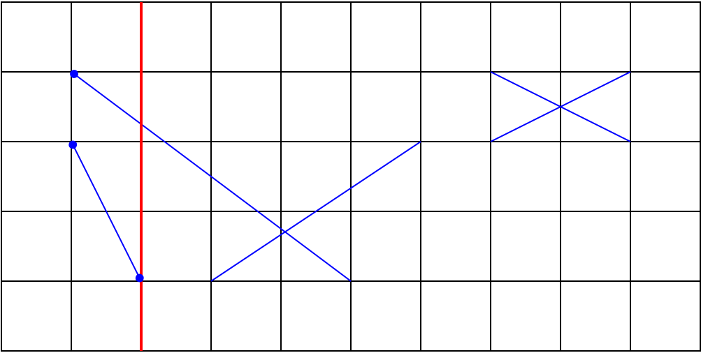

# Topics

## {.observation}
1. Geometric Approach - Idea
2. Finite Precision / Finite Resolution Geometry
	1. Ersatz Line Geometry
3. Interval Geometry
4. Topological Approaches
	1. Snap Rounding
5. Rounded Geometry

---

# Geometric Approach - Idea

## {.definition}
-  Geometric = Numeric + Combinatorial
	-  Combinatorial $\equiv$ discrete, topological relations among geometric objects [@SharmaYap]

##
-  modify existing geometry to accomplish **robustness** (not exactness) [@MehlhornYap]
	-  "ersatz geometry" in fixed precision substitutes original geometry (mostly euclidean / *"POEG"*)
	-  ensure / preserve geometric and topological properties in algorithms [@SharmaYap]
		-  e.g. planar input for voronoi diagram has planar output

---

# Finite Precision / Finite Resolution Geometry
-  usually continuous parameters
-  transforming geometric objects from continuous to discrete space
	-  e.g. Integer Grid
-  Replace existing geometry

# Ersatz Line Geometry {.sub .columns}
## {.left}
![[@MehlhornYap]](img/FinitePrecisionLine.png)

## {.right}
A.  Interval Geometry
B.  Topological Approach
	-  in the following as Polylines / Polysegments
C.  Rounded (Parameter) Geometry
D.  Discretized Geometry 
	-  not discussed here $\rightarrow$ Computergrafik

# Ersatz Line Geometry {.sub .columns}
## {.left}
![[@MehlhornYap]](img/FinitePrecisionLine.png)

## {.note .right}
-  chosen ersatz geometry depends on application needs
	-  which properties have to be preserved

---

# Interval Geometry {.columns}
## {.left}
![[@MehlhornYap]](img/FinitePrecisionLineA.png)

## Abstract {.right}
-  Interval Geometry / Fat Geometry / Epsilon Geometry
-  geometry eqiuvalent of interval arithmetic
-  focus on (approximate) predicate evaluation

# Interval Geometry {.sub .columns}
## {.left}
![[@MehlhornYap]](img/FatPointFatLine.png)

## {.right}
-  zone around line with all points in $\epsilon$ distance to the line
	-  point $\rightarrow$ disk, line $\rightarrow$ strip
-  Point(X,Y) on Line(a,b,c)? $\rightarrow$ $|aX + bY + c| < \epsilon?$
	-  different possible interpretations

# Interval Geometry {.sub}
## Applications {.example}
-  Line(a, b, c) $:= aX + bY + c = 0$ $\rightarrow$ OnLine( Intersect(l, l'), l) may fail
	-  small computational error can become catastrophic $\rightarrow$ Exact Geometric Computation? (Pascal?)
-  computational metrology $\rightarrow$ mechanical design and manufacture (tolerance)

# Interval Geometry (Segal and Sequin) {.sub}
-  *"toleranced objects"*
-  *"minimum feature separations"*
	-  close objects get merged or pushed apart

# Interval Geometry (Guibas, Salesin, Stolfi) {.sub}
-  similar to Segal and Seqiun
	- focus on points
-  predicates can return **"DON'T KNOW"** value

# Interval Geometry (General) {.sub .columns}
## {.left}
-  "zones with nonconstant descriptive complexity"
	-  fat object not limited to disks, stripes, ...

## {.right}
![[@MehlhornYap]](img/FatPolygonLine.png)

# Epsilon Tweaking {.sub}
-  avoidance of false negatives and false positives

---

# Topological Approaches {.columns}
## {.left}
![[@MehlhornYap]](img/FinitePrecisionLineB.png)

## Abstract {.right}
-  find ersatz geometry which is topologically consistent
	-  "topological consistency as a fundamental principle for achieving robustness" ([@MehlhornYap] referring to SugiharaIri)
-  substitute lines with polylines or polysegments

# Snap Rounding {.sub}
## Line Segment Intersection {.definition}
-  goal: compute arrangement of lines in a plane
-  result: **"1-skeleton"** / graph defining lines and their intersections

##
-  VLSI circuit design, hidden line elimintation, cipping and windowing, physical simulations, etc. [@MehlhornYap]

# Snap Rounding {.sub}
![1-Skeleton [@MehlhornYap]](img/1-Skeleton.png)

# Snap Rounding {.sub}
## Bentley-Ottman Algorithm {.definition}
-  Vertical Sweep Line ($x=x_0$) fills Event Queue *Q* with increasing $x_0$
	-  Start / Stop Event (Start and End of Line)
		-  Line Segments sorted by x-coordinate in *Q*
		-  Line Segments pulled from *Q* stored in binary tree *T* (sorted by y-coordinate)
		-  calculate possible intersection $q$ of neighboring Line Segments according to *T* and add $q$ to *Q*
	-  Intersection Event (order of Line Segments change in *Q*)
	- $\mathcal{O}((n + k) log n)$, with $n$ line segments and $k$ intersections

##
- maybe known as one of the Sweep Line Algorithms presented in **Einführung in den Algorithmenentwurf**

# Bentley-Ottman Algorithm {.sub}

# Bentley-Ottman Algorithm {.sub}

# Bentley-Ottman Algorithm {.sub}

# Yao-Greene Grid Model {.sub}
## {.definition}
-  unit grid $G_2 = \mathbb{Z} \times \mathbb{Z}$ (finite-precision model)
	-  defines representable numbers
	-  calculated intersection point is probably not representable

##
-  **"snap"** point $p$ to next representable point $p'$
	-  snapped point $p'$ is not in $l=[a,b]$ anymore
		-  OnLine(Intersect(l, l'), l) will fail
-  line l as polyline $l=[a, p', b]$
-  Bentley-Ottman algorithm has to be slightly adapted

# Yao-Greene Grid Model {.sub}

# Yao-Greene Grid Model {.sub}

# Simple (Snap) Rounding Rules {.sub}
## {.definition}
-  **rounding interval**: half open interval $R_1=(-\frac{1}{2}, \frac{1}{2}]$
-  **rounding square** $R_2 = R_1 \times R_1$

## {.example}
-  $x \rightarrow (x + R_1) \cap \mathbb{Z}$, denoted $\lfloor x \rceil$
	-  round up in ties (e.g. 2.5)
-  $p \rightarrow (p + R_2) \cap G_2$, denoted $\lfloor p \rceil$
	-  $+$ is the Minkowski sum

# Snap Rounding - Problems / Side Effects {.sub}
## Any Ideas? {.question}

# Snap Rounding - Problems / Side Effects {.sub}
## {.alert}
-  Unbounded Change: intersections might move after snapping
-  Cascaded and New Intersections: new (cascading) intersections as side effect

# Snap Rounding - Problems / Side Effects {.sub .columns}
## {.alert .left}
-  Drifting: modifications to polysegment drift it from original position

## {.right}
![Drifting [@MehlhornYap]](img/Drifting.png)

# Snap Rounding - Problems / Side Effects {.sub .columns}
## {.alert .left} 
-  Topological Change: e.g. topological inversion

## {.right}
![Topological Inversion [@MehlhornYap]](img/TopologicalChange.png)

# Snap Rounding - Problems / Side Effects {.sub}
## {.alert}
-  Unbounded Change
-  Cascaded and New Intersections
-  Drifting
-  Topological Change
-  Braiding

## {.note .fragment}
-  Degeneration vs. Inversion
	-  acceptable vs. not acceptable change

# Topological Approach - Outlook {.sub}
-  More on Snap Rounding: Hobby's Theorem, Yao and Greene, Milenkovic, Sugihara
-  e.g. stable algorithms (*"stability > topological consistency"*)

---

# Rounded (Parameter) Geometry {.columns}
## {.left}
![[@MehlhornYap]](img/FinitePrecisionLineC.png)

## Abstract {.right}
-  Line(a, b, c): $aX + bY + c = 0$ into Line(a', b', c') with discrete parameters
	-  Rounded Line
	-  "a line whose equation has bounded coefficients" [@SharmaYap]
	-  coefficients are bounded integers

# Rounded (Parameter) Geometry {.sub .columns}
## {.left}
![[@SharmaYap]](img/RoundedParameterGrid.png)

# Rounded (Parameter) Geometry {.sub}
## Simultaneous approximation by rationals {.definition}
-  given $a_1, ..., a_n \in \mathcal{R}$, find integers $p_1, ..., p_n$ and $q$ such that $max_{1\leq i\leq n}|a_iq - p_i|$ is minimized ([@SharmaYap] referring to Sugihara)
	-  $a', b', c'$ are representable

##
-  lattice reduction techniques to approximate the above

---

# Bibliography

::: {#refs}
:::